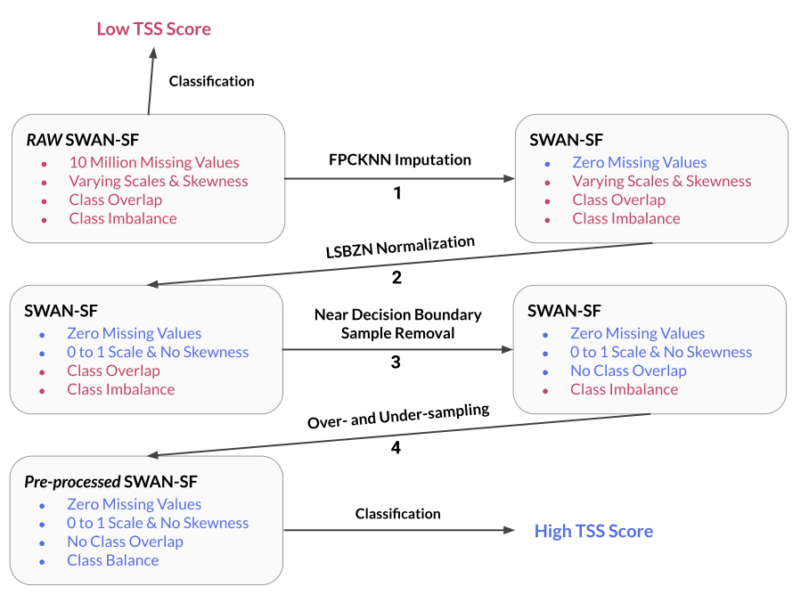

## Getting Started with the SWAN-SF Data Analysis

Welcome to our GitHub repository!

These notebooks provide a comprehensive workflow, from start to finish, for processing and analyzing the SWAN-SF dataset. They include detailed steps for reading the dataset files, performing full preprocessing, and generating a .pkl file for the processed data. Several missing value imputation techniques are implemented, such as Mean Imputation, Next-value Imputation, and our novel method—Fast Pearson Correlation-based K-nearest Neighbors (FPCKNN) Imputation.

In addition, we address class overlap with the Near Decision Boundary Sample Removal (NDBSR) technique. Various normalization methods are also applied, including Min-Max Scaling, Z-Score Normalization, and our proprietary LSBZM (Log, Square Root, BoxCox, Z-Score, and Min-Max) Normalization technique.

The notebooks further implement multiple over-sampling techniques such as SMOTE, ADASYN, TimeGAN, and Gaussian Noise Injection (GNI), as well as two under-sampling methods: Random Under Sampling and Tomek Links. These preprocessing steps collectively enhance the classification performance for predicting solar flares.

The classification models used include SVM, Random Forest, k-NN, Multilayer Perceptron, LSTM, GRU, RNN, and 1D-CNN, all designed to predict solar flares within a 24-hour window.

By using these files, researchers can significantly reduce the time required—by months—to preprocess the SWAN-SF dataset, while achieving high accuracy in solar flare prediction.



### Prerequisites

Before you start, make sure you have the following:

- **SWAN-SF Dataset**: Download it from [Harvard Dataverse](https://dataverse.harvard.edu/dataset.xhtml?persistentId=doi:10.7910/DVN/EBCFKM).
- **Python Packages**: Ensure you have these packages installed: `pandas`, `numpy`, `matplotlib`, `seaborn`, `tensorflow`, `tqdm`, `pickle`, `sklearn`, `scipy`, `imblearn`. The code for `timegan` is included in the repository, so no additional installation is required for this package.

### Setting Up Your Environment

1. **Directory Setup**: Modify the following lines in the source code to match your system's directory structure:

    ```python
    data_dir = "<Your path>/SWANSF/Downloaded_Data/"  
    data_dir_save = "<Your path>/SWANSF/code/"  
    ```

2. **Sequential Execution**: Start from Notebook 1 and proceed in order. Each notebook relies on the data prepared in the previous steps.

### Notebooks Overview

- **Notebook 1**: Reads SWAN-SF samples and combines them into a single `.pkl` file (time series samples) and a `.csv` file (labels for each partition).
- **Notebook 2**: Focuses on Missing Value Imputation, utilizing data from **Notebook 1**.
- **Notebook 3**: Centers on Near Decision Boundary Sample Removal.
- **Notebook 4 & 5**: Concentrate on Normalization.
- **Notebook 6**: Offers Visualizations of the dataset.
- **Notebook 7 & 8**: Implement Classification using eight classifiers.
- **Notebook 9**: Applies Over-sampling techniques.
- **Notebook 10**: Combines Over- and Under-sampling techniques.
- **Notebook 11, 12, & 13**: Apply preprocessing techniques post-sampling (Normalization).
- **Notebook 14, 15, 16, & 17**: Implement Classification using eight classifiers after Sampling.
- **Notebook 18**: Presents Final Visualizations.

### Copy Right

The paper associated with these notebooks has been published. We kindly ask you to provide a citation to acknowledge our work. Thank you for your support!
<p><a href="https://doi.org/10.3847/1538-4365/ad7c4a" target="_blank">DOI: 10.3847/1538-4365/ad7c4a</a>.</p>

```
@article{EskandariNasab_2024,
    doi = {10.3847/1538-4365/ad7c4a},
    url = {https://dx.doi.org/10.3847/1538-4365/ad7c4a},
    year = {2024},
    month = {oct},
    publisher = {The American Astronomical Society},
    volume = {275},
    number = {1},
    pages = {6},
    author = {MohammadReza EskandariNasab and Shah Muhammad Hamdi and Soukaina Filali Boubrahimi},
    title = {Impacts of Data Preprocessing and Sampling Techniques on Solar Flare Prediction from Multivariate Time Series Data of Photospheric Magnetic Field Parameters},
    journal = {The Astrophysical Journal Supplement Series}
}
```

---
